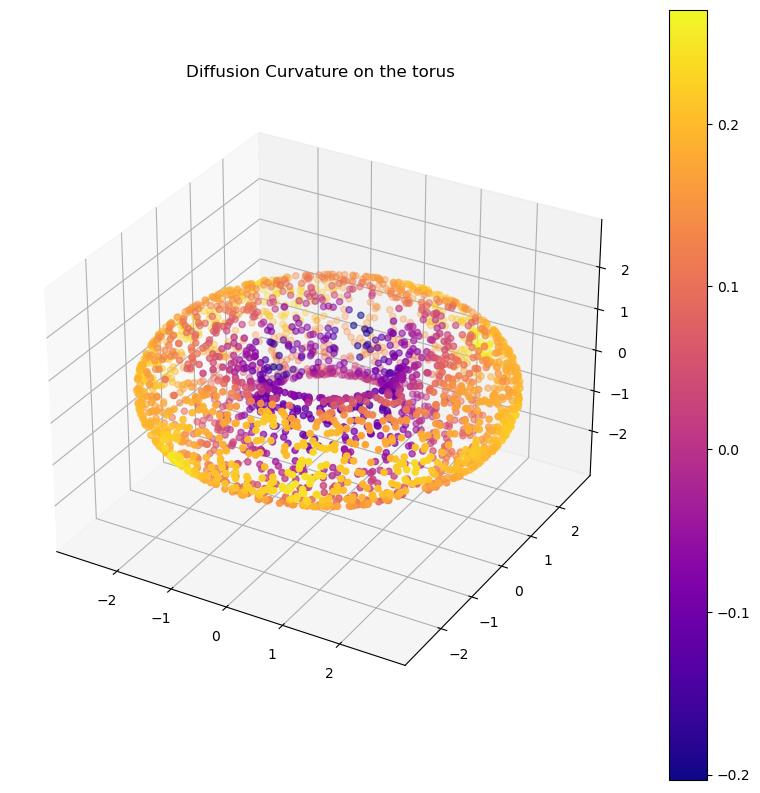

# Diffusion Curvature

<!-- WARNING: THIS FILE WAS AUTOGENERATED! DO NOT EDIT! -->

Diffusion curvature is a pointwise extension of Ollivier-Ricci
curvature, designed specifically for the often messy world of pointcloud
data. Its advantages include:

1.  Unaffected by density fluctuations in data: it inherits the
    diffusion operator’s denoising properties.
2.  Fast, and scalable to millions of points: it depends only on matrix
    powering - no optimal transport required.

## Install

<!-- To install with conda (or better yet, mamba),
```sh
conda install diffusion-curvature -c riddlelabs
``` -->

To install with pip (or better yet, poetry),

``` sh
pip install diffusion-curvature
```

or

``` sh
poetry add diffusion-curvature
```

Conda releases are pending.

## Usage

To compute diffusion curvature, first create a `graphtools` graph with
your data. Graphtools offers extensive support for different kernel
types (if creating from a pointcloud), and can also work with graphs in
the `PyGSP` format. We recommend using `anistropy=1`, and verifying that
the supplied knn value encompasses a reasonable portion of the graph.

``` python
from diffusion_curvature.datasets import torus
import graphtools
X_torus, torus_gaussian_curvature = torus(n=5000)
G_torus = graphtools.Graph(X_torus, anisotropy=1, knn=30)
```

Graphtools offers many additional options. For large graphs, you can
speed up the powering of the diffusion matrix with landmarking: simply
pass `n_landmarks=1000` (e.g) when creating the graphtools graph. If you
enable landmarking, `diffusion-curvature` will automatically use it.

Next, instantiate a
[`DiffusionCurvature`](https://professorwug.github.io/diffusion_curvature/core%20(graphtools).html#diffusioncurvature)
operator.

``` python
from diffusion_curvature.graphtools import DiffusionCurvature
DC = DiffusionCurvature(t=12)
```

------------------------------------------------------------------------

<a
href="https://github.com/professorwug/diffusion_curvature/blob/main/diffusion_curvature/graphtools.py#LNone"
target="_blank" style="float:right; font-size:smaller">source</a>

### DiffusionCurvature

>      DiffusionCurvature (t:int, distance_type='PHATE', use_entropy:bool=False,
>                          **kwargs)

Initialize self. See help(type(self)) for accurate signature.

|               | **Type** | **Default** | **Details**                                                                                                       |
|---------------|----------|-------------|-------------------------------------------------------------------------------------------------------------------|
| t             | int      |             | Number of diffusion steps to use when measuring curvature. TODO: Heuristics                                       |
| distance_type | str      | PHATE       |                                                                                                                   |
| use_entropy   | bool     | False       | If true, uses KL Divergence instead of Wasserstein Distances. Faster, seems empirically as good, but less proven. |
| kwargs        |          |             |                                                                                                                   |

And, finally, pass your graph through it. The
[`DiffusionCurvature`](https://professorwug.github.io/diffusion_curvature/core%20(graphtools).html#diffusioncurvature)
operator will store everything it computes – the powered diffusion
matrix, the estimated manifold distances, and the curvatures – as
attributes of your graph. To get the curvatures, you can run `G.ks`.

``` python
G_torus = DC.curvature(G_torus, dimension=2)
```

``` python
plot_3d(X_torus, G_torus.ks, colorbar=True, title="Diffusion Curvature on the torus")
```


